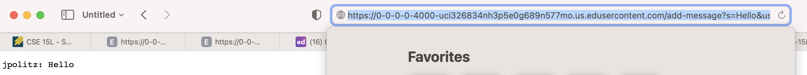
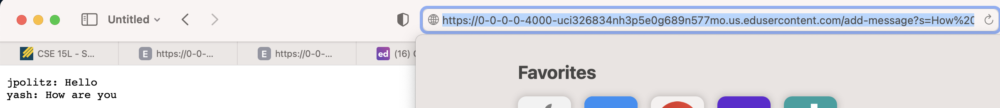
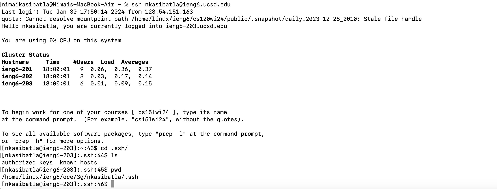
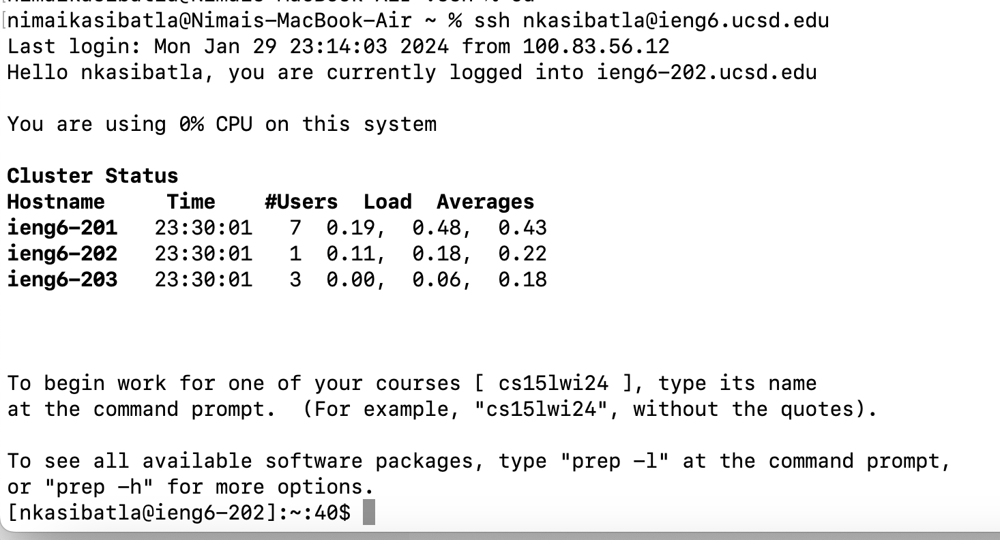

# CSE 15L Lab Report 2: Servers and SSH Keys 

## Part 1: Web Server: ChatServer

**```ChatServer.java``` Code:**

```
import java.io.BufferedWriter;
import java.io.FileWriter;
import java.io.IOException;
import java.io.PrintWriter;
import java.net.URI;
import java.nio.file.Files;
import java.nio.file.Paths;
import java.util.List;

class StringHandler implements URLHandler {
  List<String> lines;
  String path;
  StringHandler(String path) throws IOException {
    this.path = path;
    this.lines = Files.readAllLines(Paths.get(path));
  }
  public String handleRequest(URI url) throws IOException {
    String query = url.getQuery();
    if(url.getPath().equals("/add-message")) {
      if(query.startsWith("s=")) {
        String[] args = query.split("&");
        String[] userArr = args[1].split("=");
        String user = userArr[1].replace("+", " ");
    
        String[] valueArr = args[0].split("=");
        String statement = valueArr[1].replace("+", " ");

        this.lines.add(user + ": " + statement);
    
        return String.join("\n", lines) + "\n";
      }
      else {
        return "requires a parameter";
      }
    }
    else {
      return String.join("\n", lines) + "\n";
    }
  }
}

class ChatServer {
  public static void main(String[] args) throws IOException {
    if(args.length == 0){
      System.out.println("Missing both port number and file path! For the first argument (port number), try any number between 1024 to 49151. For the second argument (file path), give a path to a text file.");
      return;
    }
    if(args.length == 1){
      System.out.println("Missing port number or file path! For the first argument (port number), try any number between 1024 to 49151. For the second argument (file path), give a path to a text file.");
      return;
    }

    int port = Integer.parseInt(args[0]);

    Server.start(port, new StringHandler(args[1]));
  }
}
```

**```Server.java``` Code:**

```
// A simple web server using Java's built-in HttpServer

// Examples from https://dzone.com/articles/simple-http-server-in-java were useful references

import java.io.IOException;
import java.io.OutputStream;
import java.net.InetSocketAddress;
import java.net.URI;

import com.sun.net.httpserver.HttpExchange;
import com.sun.net.httpserver.HttpHandler;
import com.sun.net.httpserver.HttpServer;

interface URLHandler {
    String handleRequest(URI url);
}

class ServerHttpHandler implements HttpHandler {
    URLHandler handler;
    ServerHttpHandler(URLHandler handler) {
      this.handler = handler;
    }
    public void handle(final HttpExchange exchange) throws IOException {
        // form return body after being handled by program
        try {
            String ret = handler.handleRequest(exchange.getRequestURI());
            // form the return string and write it on the browser
            exchange.sendResponseHeaders(200, ret.getBytes().length);
            OutputStream os = exchange.getResponseBody();
            os.write(ret.getBytes());
            os.close();
        } catch(Exception e) {
            String response = e.toString();
            exchange.sendResponseHeaders(500, response.getBytes().length);
            OutputStream os = exchange.getResponseBody();
            os.write(response.getBytes());
            os.close();
        }
    }
}

public class Server {
    public static void start(int port, URLHandler handler) throws IOException {
        HttpServer server = HttpServer.create(new InetSocketAddress(port), 0);

        //create request entrypoint
        server.createContext("/", new ServerHttpHandler(handler));

        //start the server
        server.start();
        System.out.println("Server Started!");
    }
}
```


**First add message screenshot:**



### Which methods in your code are called?

The methods called in the code include ```handle()```, ```start()```, ```main()```, and ```handleRequest()```.

### What are the relevant arguments to those methods, and the values of any relevant fields of the class?

Arguments to Methods:

```handle()```: ```HttpExchange exchange``` which represents the Http request and response 
```start()```: ```int port, URLHandler handler``` which requires the port and handler as parameters within the method 
```handleRequest()```: ```URI url``` which represents the URL
```main()```: ```String[] args``` which takes in the argument such as the port and text file path

Fields of class ```StringHandler```:

```List<String> lines```
```String path```
```String query = url.getQuery()```
```String user``` user of the query such as "jpoltz" and "yash"
```String statement``` which is the statement made by the user 

Fields of class ```ServerHttpHandler```:

```String ret```
```String response```

Fields of class ```Server```:

```Http Server``` created with the port 

Fields of class ```ChatServer```:

```main()```: ```int port = args[0]``` which is the first argument is the port, provided when the code is compiled

### How do the values of any relevant fields of the class change from this specific request? If no values got changed, explain why.

The list ```lines``` is modified when the query request being made is valid. When valid, a new statement or message is appended to the ```lines``` list. This this
list is later returned. When the query of the website is modified in a valid way this ```lines``` list is modified as well. 


**Explanation:**
The method in my code that is called is the ```handle``` method in the ```ServerHttpHandler``` class which implements the ```HttpHandler``` interface. 
The relevant argument to that method is the ```HttpExchange exchange``` which represents the Http request and response. Some of the relevant fields include 
the ```URLHandler handler``` in the ```ServerHttpHandler```. This is an instance of the ```StringHandler```. Another relevant field is the ```List<String> lines``` and ```String path```
in ```StringHandler```. These represent the the lines read from a file path. If the request is valid, then the new statement or message is added to the ```lines``` list. Then this 
list is later returned. 

**Second add message screenshot:**



The methods called in the code include ```handleRequest()```.

### What are the relevant arguments to those methods, and the values of any relevant fields of the class?

The relative argument to the ```handleRequest()``` method is the ```URI url```, which is the url of the website. The fields of ```statement``` and ```user``` are changed
to the values given in a valid query request. 

### How do the values of any relevant fields of the class change from this specific request? If no values got changed, explain why.

The list ```lines``` is modified when the query request being made is valid. When valid, a new statement or message is appended to the ```lines``` list. This this
list is later returned. When the query of the website is modified in a valid way this ```lines``` list is modified as well. 


**Explanation:**
The method in my code that is called is the ```handle``` method in the ```ServerHttpHandler``` class which implements the ```HttpHandler``` interface. 
The relevant argument to that method is the ```HttpExchange exchange``` which represents the Http request and response. Some of the relevant fields include 
the ```URLHandler handler``` in the ```ServerHttpHandler```. This is an instance of the ```StringHandler```. Another relevant field is the ```List<String> lines``` and ```String path```
in ```StringHandler```. These represent the the lines read from a file path. If the request is valid, then the new statement or message is added to the ```lines``` list. Then this 
list is later returned. 

## Part 2: SSH Keys


**Public Key Absolute Path using ```ls```:**



**Private Key Absolute Path using ```ls```:**


**Login without using password using ```ls```:**



## Part 3: Takeaways and Overall Learning from Labs 2 & 3


**Thing Learned:**

One thing that I learned from lab these past 2 weeks is setting up my Visual Studio code and specifically using the teriminal within my local device or even 
Visual Studio Code itself to generate SSH keys. I've learned about SSH key generation and configuration to allow for effortless, secure logins from local device, 
Visual Studio Code or EdStem to the @ieng6 server. I also gained knowledge about ports, localhosts, and how to setup a localhost to run Java applications and files.


